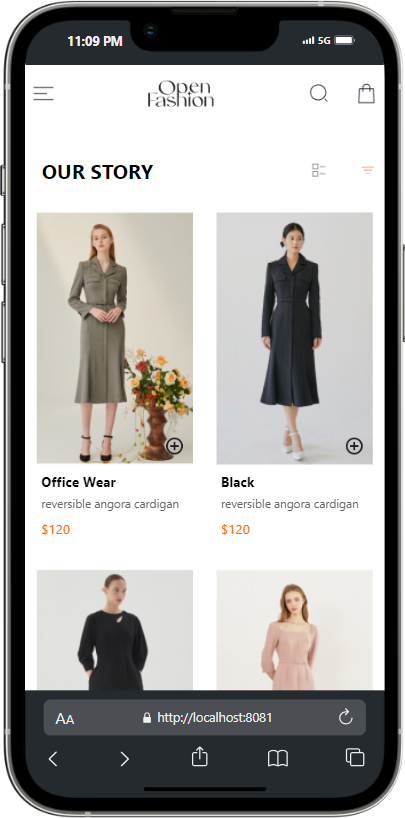
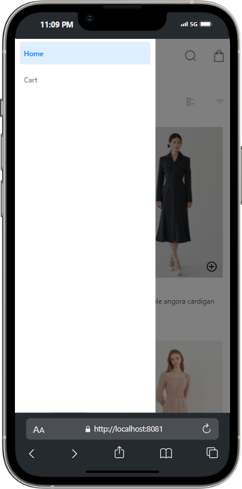
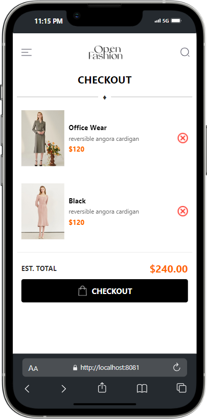

# rn-assignment6-11022557

## Mobile Application Development Assignment 6

**ID:**  11022557

This repo contains three pages, one for the homescreen where I rendered items in the e-commerce platform with an option to add to cart button. a modal openeing that gives you the ability to navigate to the checkout page. The chekout page contain a button that could be used to remove items from the cart and also I used Local storage to persist items on the app.

## Table of Contents

- [Installation](#installation)
- [Usage](#usage)
- [Components](#components)
- [Screenshots](#screenshots)

## Installation

1. Clone the repository to your local machine:

   ```bash
   git clone https://github.com/steveAzo/rn-assignment6-11022557.git
   cd rn-assignment4- 11022557

## Usage

This application displays how themes work in mobile app applications and all other applications.

## Components

### HomePage

**File:** `components/HomePage.js`

* **Usage:** Displays transactions.

## Screenshots

### Home, Modal opening and Checkout page





